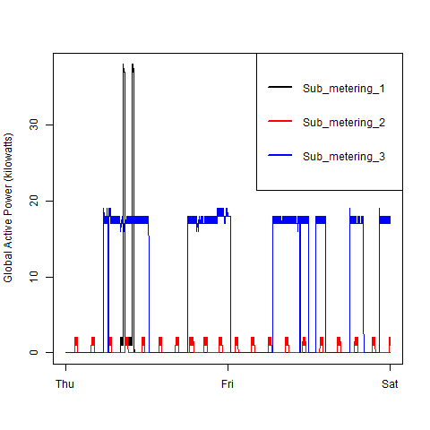
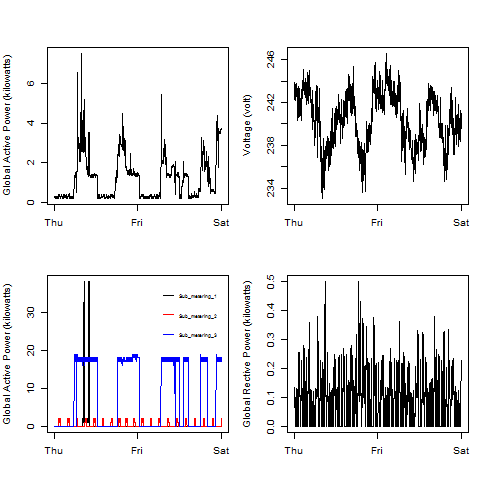

# ExploratoryDataAnalysis

Here are the .R scripts and .PNG files for Project 1 of the Johns Hopkins "Exploratory Data Analysis". There are 4 .R script files and 4 PNG files that are the results of these script files.  

To run these scripts, you should proceed with the following steps:
* Download the scripts (plot1.R, plot2.R, plot3.R, plot4.R) to some directory.
* Download the data from here: https://d396qusza40orc.cloudfront.net/exdata%2Fdata%2Fhousehold_power_consumption.zip;
* Extract the data into the ./data directory.  The ./data directory should be parallel to your scripts directory
* Run the scripts

Here are my resultant plots....

### Plot 1

### Plot 2

### Plot 3

### Plot 4

  
